# quickshell-config

My [Quickshell](https://quickshell.outfoxxed.me/) desktop shell config for Hyprland — panels (control center, launcher, lockscreen, media, power, wallpaper picker, sys info, visualizer) and backing services (audio, battery, brightness, network, power profile, colors, sys stats), plus a Pill-style bar widget.

Originally lived inside my [nixos-dots](https://github.com/aquamarine3006/nixos-dots) flake; split out here so it can be dropped into any setup, NixOS or not.

## Preview

<table>
<tr>
<td>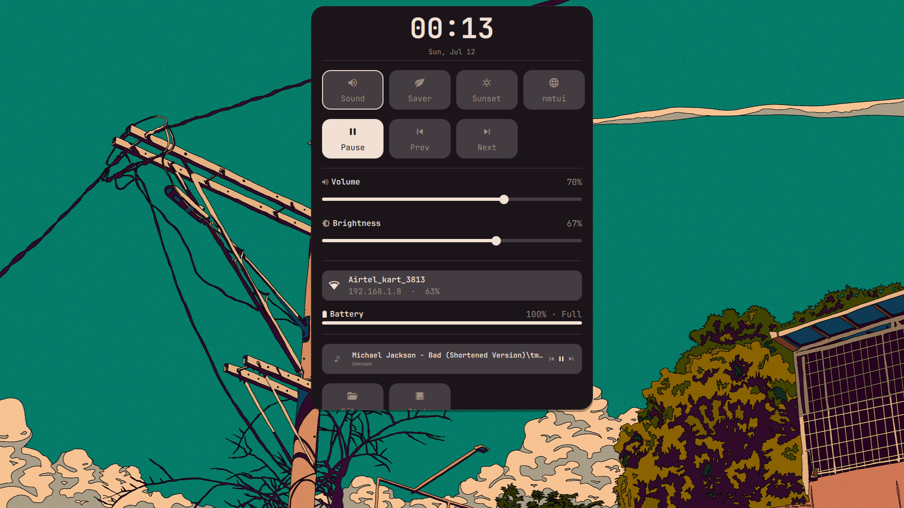<br/><sub>Control center (dark)</sub></td>
<td>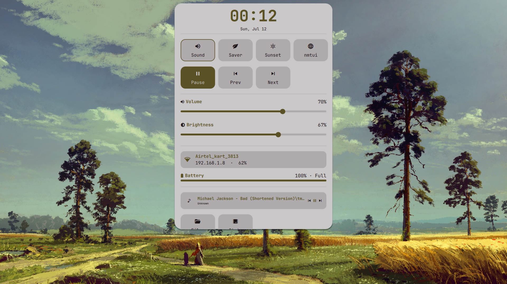<br/><sub>Control center (light)</sub></td>
</tr>
<tr>
<td>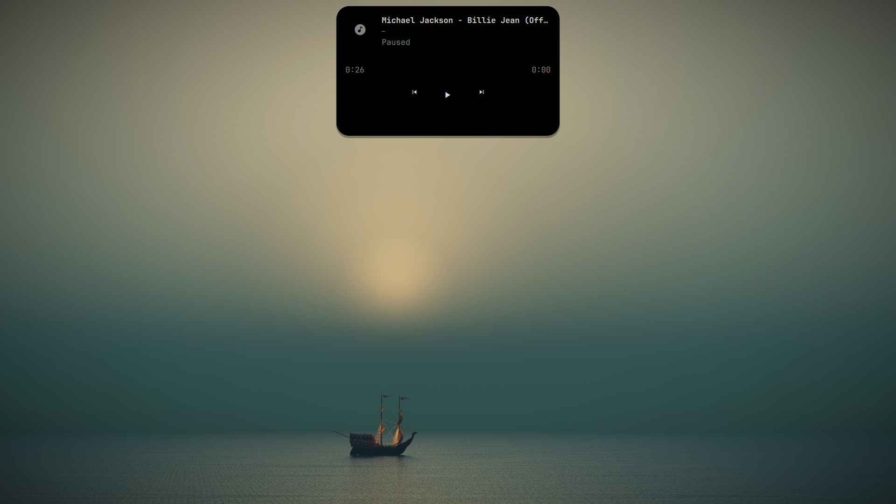<br/><sub>Media panel</sub></td>
<td>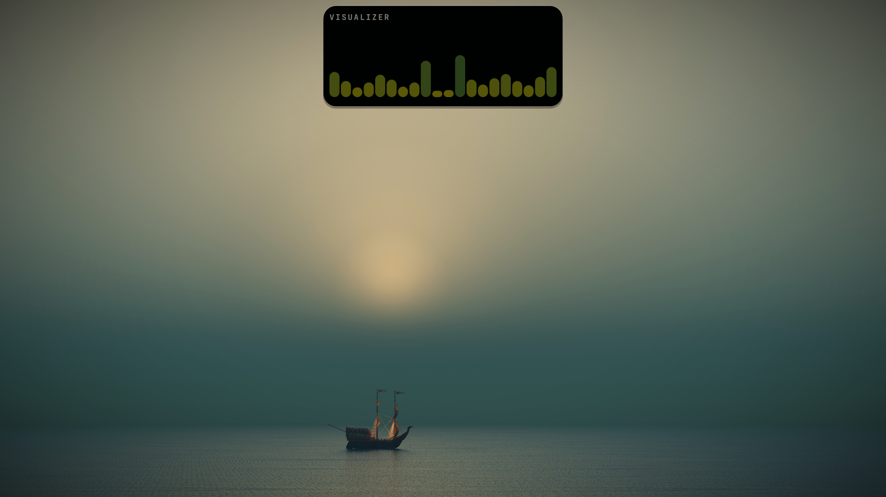<br/><sub>Audio visualizer</sub></td>
</tr>
<tr>
<td>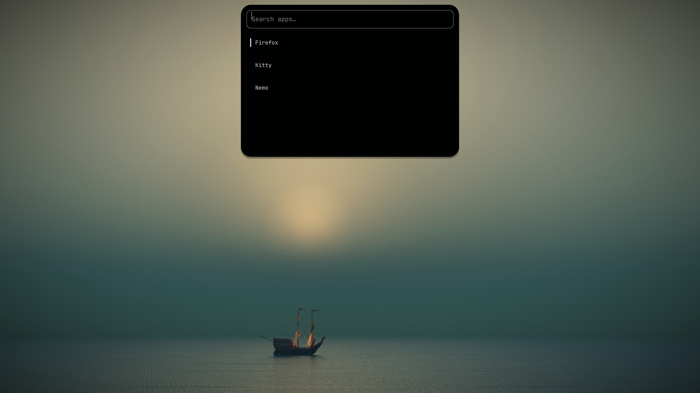<br/><sub>App launcher</sub></td>
<td>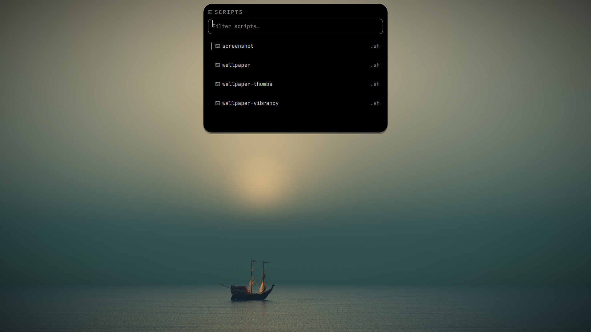<br/><sub>Script launcher</sub></td>
</tr>
<tr>
<td>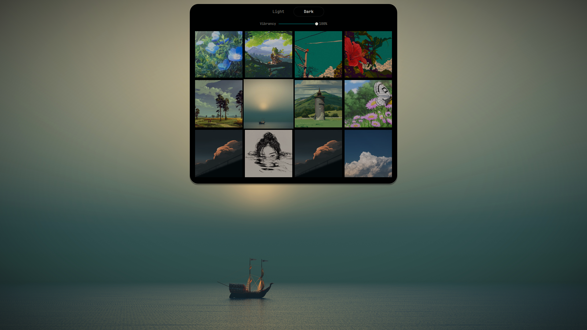<br/><sub>Wallpaper picker</sub></td>
<td>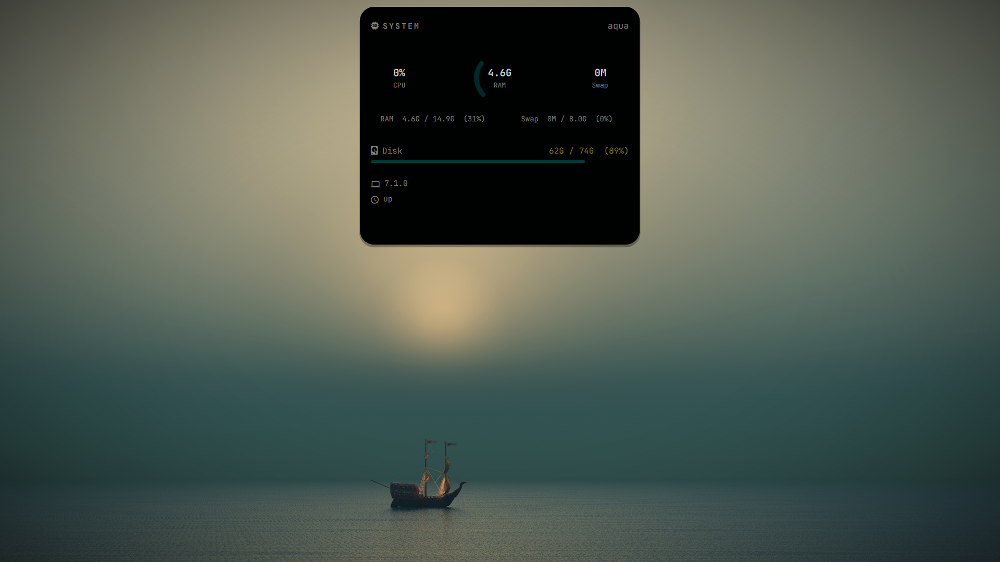<br/><sub>System info panel</sub></td>
</tr>
<tr>
<td>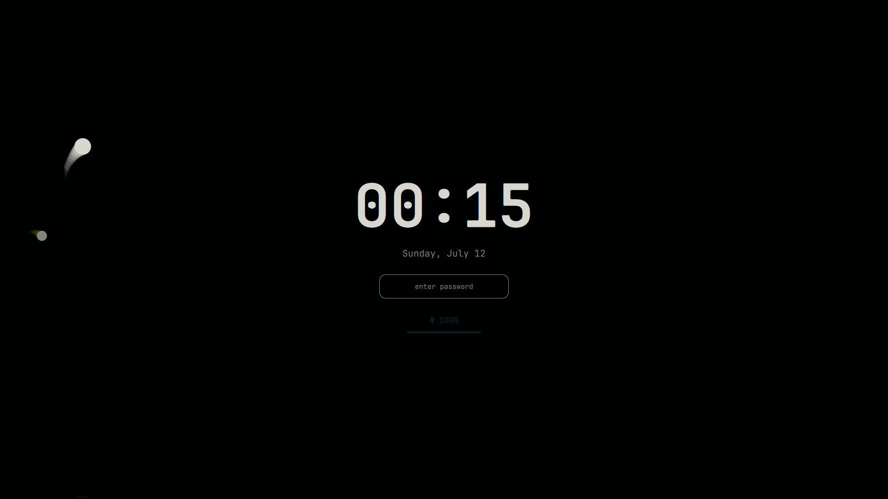<br/><sub>Lockscreen</sub></td>
<td>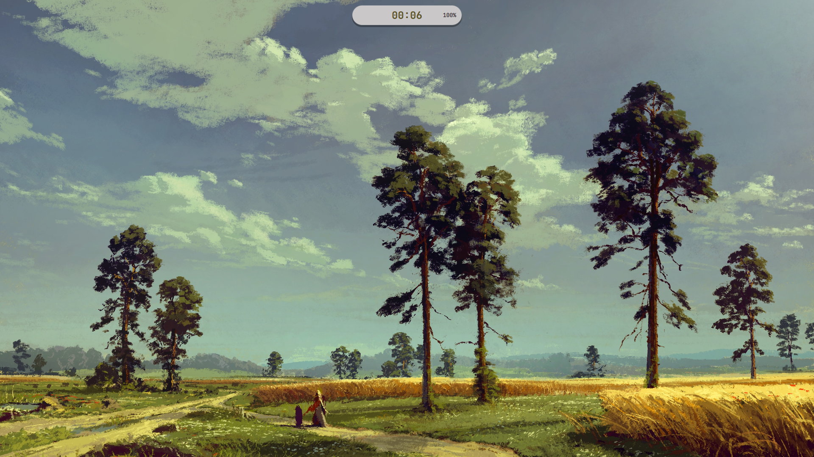<br/><sub>Idle-screen OSD</sub></td>
</tr>
<tr>
<td><br/><sub>Volume OSD</sub></td>
<td>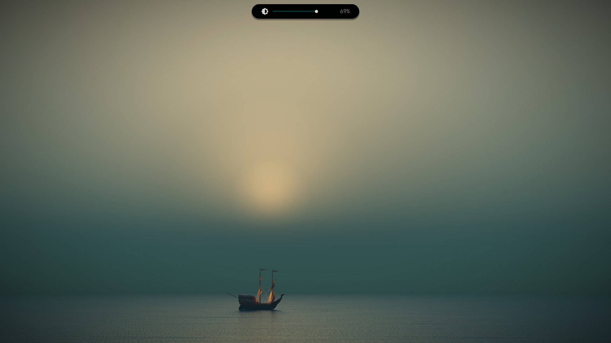<br/><sub>Brightness OSD</sub></td>
</tr>
</table>

## Structure

```
shell.qml              entry point
Pill.qml                bar widget
panels/                 UI panels shown by the shell
services/               singletons providing data to panels (Audio, Battery, Network, Colors, etc.)
extra/scripts/          wallpaper + screenshot helper scripts some panels shell out to (optional, see below)
extra/wallust/          leftover wallust template, not required -- see Theming
```

## Dependencies

- [Quickshell](https://quickshell.outfoxxed.me/) itself
- [Hyprland](https://hyprland.org/) — this config is Hyprland-specific (`shell.qml` imports `Quickshell.Hyprland` directly, and several panels/services dispatch via `hyprctl`). It will not work on other compositors.
- `bash`, standard coreutils
- Whatever CLI tools the individual `services/*.qml` files shell out to for audio/network/battery/etc. (e.g. PipeWire tools, NetworkManager) — not fully audited here, so if a panel comes up blank, check that file's `Process`/`Quickshell.execDetached` calls for the binary it expects.

**No longer a dependency:** wallust. Colors are now a static hardcoded palette (see Theming below) rather than being generated live from your wallpaper.

## Installation

1. Copy (or clone) this repo's contents directly into `~/.config/quickshell/`, so you end up with:
   ```
   ~/.config/quickshell/shell.qml
   ~/.config/quickshell/Pill.qml
   ~/.config/quickshell/panels/...
   ~/.config/quickshell/services/...
   ```
   (Don't nest it in a subfolder unless you also pass `-c <subfolder>` when launching — see below.)

2. Launch it:
   ```sh
   quickshell
   ```
   or wire it into Hyprland's autostart:
   ```
   exec-once = quickshell
   ```
   If you keep the config in a named subdirectory instead of directly in `~/.config/quickshell/`, launch with `quickshell -c <name>` instead.

3. (Optional) Wallpaper picker / screenshot scripts. The `WallpaperContent.qml` panel and `Pill.qml` shell out to scripts at `~/scripts/*.sh` for actually setting the wallpaper, generating thumbnails, adjusting vibrancy, and taking screenshots. These aren't included as a required step — copy `extra/scripts/*.sh` to `~/scripts/` and `chmod +x` them if you want those buttons to do something; otherwise those specific actions will just no-op or fail quietly.

That's it — no wallust, no color-generation pipeline to set up. The shell will render with a fixed color scheme out of the box.

## Theming

`services/Colors.qml` now exposes a static, hardcoded palette (a Tokyo Night–style dark theme) instead of reading a wallust-generated JSON file. Every panel/service reads from this same singleton via `Colors.background`, `Colors.color0`–`Colors.color15`, etc.

To customize the look, just edit the hex values directly in `services/Colors.qml`. To make it dynamic again (e.g. wire up your own wallpaper-based theme generator), replace the static properties with a `FileView` + `JsonAdapter` reading a JSON file of your choice, keeping the same property names so nothing downstream needs to change.

## Notes

- No absolute paths or usernames are hardcoded; everything routes through `$HOME`.
- `extra/wallust/quickshell.json` is kept only as a historical reference for the JSON shape the old dynamic pipeline expected — it's not read by anything in this repo anymore.
